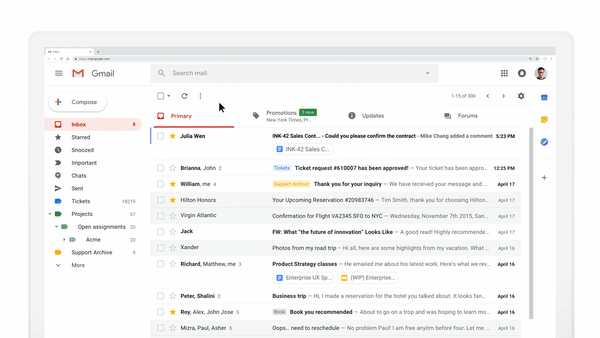

# AMP Email——构建可交互的动态邮件

如果你是Gmail和Google Docs的用户，相信你肯定用过Google Docs的评论及时回复功能：你的同事在你的design doc（设计文档）中留了几个评论，一会后你收到一封邮件提醒，你只需在邮件的回复输入里填写回复并发送即可，从头到尾不需要离开那封提醒邮件即完成了一个任务。

不知你是否好奇过这是怎么做到的，毕竟我们习以为常的邮件要不是纯文字的，要不就是没有JS加载的静态HTML页面。这背后的技术叫AMP Email，官方网站是[https://amp.dev/about/email](https://amp.dev/about/email/)。先撇开AMP Email不说，AMP （Accelerated Mobile Pages）可能听过或了解的人更多点。它起初是由Google的[Malte Ubl](https://www.linkedin.com/in/malteubl)于15年设计并推广，旨在提高网页的首次加载速度，从而提升手机端的用户体验，毕竟手机浏览器和桌面版相比性能和带宽都受限。AMP作为Google的mobile web的战略性策略之一，利用其搜索引擎老大哥的地位，制定新的游戏规则，给内容商提供一点甜头，进一步巩固它对移动网络内容的创建和分发规则的绝对掌控权。Facebook Instant Articles、Apple News、Baidu MIP都是异曲同工的策略。

技术上来说，AMP简单地讲就是一个阉割版的web component框架，通过提供一套opinionated的组件来代替对native JS的使用需求，再通过服务器端预渲染和Google自家CDN缓存，进一步减少客户端加载时间和渲染时间。AMP Email就是把AMP的那套思路运用到Email这个特殊的互联网文本中，从而实现可交互的动态邮件！撇开Google自身的利益和企图不说，如果这个技术能帮助终端邮件用户获得更好的邮件浏览体验、快速地完成传统的Click To Actions \(CTAs\)，未必不失为一个有价值的技术。

**References**

* [**https://zhuanlan.zhihu.com/p/42919326**](https://zhuanlan.zhihu.com/p/42919326)\*\*\*\*
* \*\*\*\*[**https://zhuanlan.zhihu.com/p/21741712**](https://zhuanlan.zhihu.com/p/21741712)\*\*\*\*

