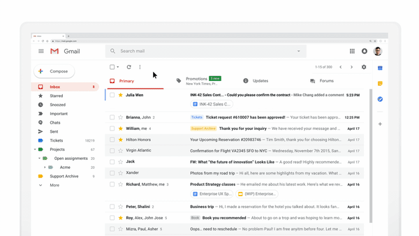
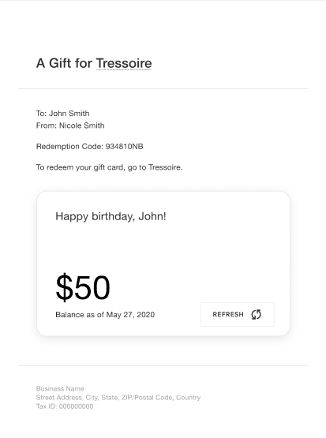
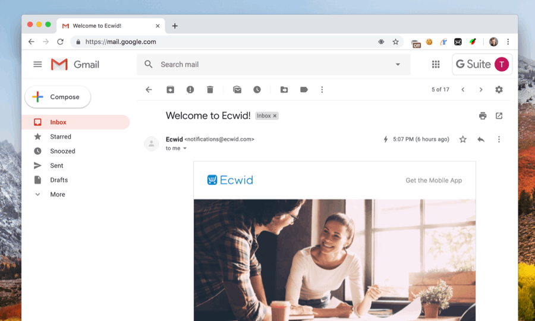

# AMP Email——构建可交互的动态邮件

如果你是Gmail和Google Docs的用户，相信你肯定用过Google Docs的评论及时回复功能：你的同事在你的design doc（设计文档）中留了几个评论，一会后你收到一封邮件提醒，你只需在邮件的回复输入里填写回复并发送即可，从头到尾不需要离开那封提醒邮件即完成了一个任务。



不知你是否好奇过这是怎么做到的，毕竟我们习以为常的邮件要不是纯文字的，要不就是没有JS加载的静态HTML页面。这背后的技术叫AMP Email，官方网站是[https://amp.dev/about/email](https://amp.dev/about/email/)。先撇开AMP Email不说，AMP （Accelerated Mobile Pages）可能听过或了解的人更多点。它起初是由Google的[Malte Ubl](https://www.linkedin.com/in/malteubl)于15年设计并推广，旨在提高网页的首次加载速度，从而提升手机端的用户体验，毕竟手机浏览器和桌面版相比性能和带宽都受限。AMP作为Google的mobile web的战略性策略之一，利用其搜索引擎老大哥的地位，制定新的游戏规则，给内容商提供一点甜头，进一步巩固它对移动网络内容的创建和分发规则的绝对掌控权。Facebook Instant Articles、Apple News、Baidu MIP都是异曲同工的策略。

技术上来说，AMP简单地讲就是一个阉割版的web component框架，通过提供一套opinionated的组件来代替对native JS的使用需求，再通过服务器端预渲染和Google自家CDN缓存，进一步减少客户端加载时间和渲染时间。AMP Email就是把AMP的那套思路运用到Email这个特殊的互联网文本中，从而实现可交互的动态邮件！撇开Google自身的利益和企图不说，如果这个技术能帮助终端邮件用户获得更好的邮件浏览体验、快速地完成传统的Click To Actions \(CTAs\)，未必不失为一个有价值的技术。

想像下你能在邮件里完成一个医生预约，更新预约，发表就诊体验留言，或者把喜欢的推荐产品加到购物清单里（wishlist），或者查看订单的物流信息，节省了打开多个Tab加载各种不一样的网页来完成一个任务的时间。

在笔者就职的公司Squarepace里，我们每年会有两次Hack Week，就是长达一周的Hacksoon。在Hack Week里，大家可以做自己任何想做的实验和项目，尝试一些新的ideas，大部分最后都不会真正上线，但是通过这种形式可以带动员工的创造性和积极性，以期提高公司整体的产品创造力。在五月末的这次Hack Week里，我尝试了把我们产品中发给用户的部分email转化成AMP Email，希望以此来改善用户体验，从而提高用户对我们的品牌认知。

以礼品卡邮件为例，当一个买家在某个Squarespace商家的网站上买了他们的礼品卡后，礼品卡接收人会收到一封邮件，里面包含了礼品卡金额、卡号、问候语等主要信息。用过礼品卡的朋友可能有过这个痛点，就是一张大额的礼品卡用了一次后放了一段时间，等到想起来再想去用时忘了里面还有多少余额，在美国大型的零售商的礼品卡一般支持打电话或者去官网查询余额。但Squarespace的礼品卡功能目前还不支持买家直接查询余额，现在的唯一途径是假装checkout，输入礼品卡号，在checkout里我们会告诉你礼品卡的余额。可想而知，这并不是理想的用户体验。我们就设想在礼品卡邮件里添加一个礼品卡余额查询模块，这样买家只需打开那封礼品卡邮件就能实时看到里面的余额——看起来非常理想的AMP使用场景！

现在我来粗略地讲解下整个实现流程及一些体会。本质上我们需要在邮件里异步调用我们后端系统的礼品卡余额查询接口，然后把拿到的余额动态展示在邮件里。我的Hack Week项目合伙人设计师Sean帮我设计了一个拟物化的礼品卡余额查询UI，见下图。



对web工程熟悉的朋友应该不难理解接下来的几大步骤：1）实现后端礼品卡余额查询接口 2）实现邮件端**跨域**异步请求 3）实现邮件客户端动态内容渲染。

第一步的后端接口实现不难，给定一个礼品卡号`GCABCD1234XYZ`, 回复其余额和对应的查询日期`{"balance": "$25.00", timestamp: "May 27, 2020"}`。应为是个读请求，理所当然地就用`GET`**。**这里其实是第一个gotcha，因为在这个例子中使用`GET`是个安全漏洞，错在把礼品卡原文直接放在了query parameter那`http://foo.com/api/giftcards?code=GCABCD1234XY`**，**和用户密码、信用卡的常规安全措施一样，礼品卡号也必须在传输过程中端对端加密，不然就很容易被链路上的各种middle man监听盗取。和密码盗用、信用卡盗用相比，礼品卡使用我从来没见过两步验证\(2FA\)，也就是说要盗用一个礼品卡号要比盗用一个信用卡号容易得多。堵住这个安全漏洞的办法是强制使用HTTPS协议，并且把关键请求信息用Request Body来封装，而不是在query parameter那裸奔。如果还想再强化下，可以考虑对礼品卡号进行客户端加密，在服务器端解密回来。

第二步是最麻烦的一步，需要处理很多跨域请求带来的安全问题。在通常的web应用中，实现异步请求常用的方法是XMLHttpRequest \(XHR\) 或者最新的Fetch API，但两者都需使用JS调用，而AMP把native JS给阉割了。取而代之的是几个封装好的web component，`amp-list` `amp-form`。`amp-list` 提供了异步读取请求功能和模板化列表视图的渲染，`amp-form`提供了异步读写请求功能和模板化视图渲染，可以用于传统的表单提交，也可用于任意的异步写请求（使用POST verb）。对于礼品卡余额查询请求，上面提到它不能是GET请求，所以我们只能用`amp-form`的POST请求。由于是跨域请求 \(CORS\)，我们的API实现里得首先验证请求源的合法性 \(origin\)， 在最后回复请求时还得额外添加好几个header来完成CORS的服务端验证流程 \(详情参考[官方文档](https://amp.dev/documentation/guides-and-tutorials/learn/amp-caches-and-cors/amp-cors-requests/)\)。对于写请求，通常情况下它可能需要额外的服务端身份验证，比如cookie、session、auth token等验证方式。AMP Emai可以在客户端永久保留，cookie或者session等短时效的验证方式显然不适用。AMP官方推荐的是使用access token的方式，每个需要身份验证请求的邮件在构建时需要传入一个access token，这个令牌可以用来限制API调用次数或频率的，也可以用来拒绝恶意软件的暴力攻击。

搞定第二步后，在邮件客户端实现动态内容渲染其实并不难，熟悉HTML和React的朋友都能轻松上手。

最简单的HelloWorld示例代码, 几个关键点：html标签上的`⚡4email`属性，AMP的JS框架异步加载，`amp-custom`属性来界定AMP的CSS规则。


```markup
<!doctype html>
<html ⚡4email>
<head>
  <meta charset="utf-8">
  <script async src="https://cdn.ampproject.org/v0.js"></script>
  <style amp4email-boilerplate>body{visibility:hidden}</style>
  <style amp-custom>
    h1 {
      margin: 1rem;
    }
  </style>
</head>
<body>
  <h1>Hello, I am an AMP EMAIL!</h1>
</body>
</html>
```


定义了一个`animal-template`模板的的示例邮件，表单提交有几个lifecycle event，每个event可以用来渲染一个不同的视图；一个用户交互动作可以隐藏或者动态展示一些内容。

```markup
<html ⚡4email>
<head>
  <meta charset="utf-8">
  <script async src="https://cdn.ampproject.org/v0.js"></script>
  <script async custom-element="amp-list" src="https://cdn.ampproject.org/v0/amp-list-0.1.js"></script>
  <script async custom-element="amp-form" src="https://cdn.ampproject.org/v0/amp-form-0.1.js"></script>
  <script async custom-template="amp-mustache" src="https://cdn.ampproject.org/v0/amp-mustache-0.2.js"></script>
  <style amp4email-boilerplate>body{visibility:hidden}</style>
</head>
<body>
  <!--
    Define a template and give it an `id` to allow it to be used from both `amp-list` and `amp-form`.
  -->
  <template id="animal-template" type="amp-mustache">
    <p>This displays data sent from a server.</p>
    {{#animal}}
    <p>You have selected {{animal}}.</p>
    {{/animal}}
  </template>
  <!--
    When the user changes the selection, the change event triggers the form submission and hides the `amp-list`: `on="change:animal-form.submit,animal-list.hide"`.

    The `amp-form` renders the server response using the same template as `amp-list`, making the switch from `amp-list` to `amp-form` appear seamless.

    Note: Use a placeholder to make the loading state look the same as the submitting state for the form.
  -->
  <div>
    <form id="animal-form" method="get" action-xhr="https://amp.dev/documentation/examples/api/echo">
      <div>
        <p>Select an animal to update the server response.</p>
        <select name="animal" on="change:animal-form.submit,animal-list.hide">
          <option value="dog">Dog</option>
          <option value="cat">Cat</option>
          <option value="parrot">Parrot</option>
        </select>
      </div>
      <div submitting>Loading ...</div>
      <div submit-success template="animal-template"></div>
    </form>
    <amp-list id="animal-list" items="." single-item template="animal-template" src="https://amp.dev/documentation/examples/api/echo" layout="fixed-height" height="50">
      <div placeholder>Loading ...</div>
    </amp-list>
  </div>
</body>
</html>
```

更多的例子可参考[AMP Playground](https://playground.amp.dev/?runtime=amp4email)。

目前业界已经有几个大公司开始试水AMP Email，比如Booking.com, Pinterest。下面的几个动图可以形象地展示AMP Email的表达性和交互性。




AMP Email的局限性有以下几点：

* 目前只有几个大厂的邮件客户端支持它：Gmail, Outlook, Mail.ru
* 由于目前普及度有限，实际产品中你需要同时准备一个传统HTML格式的邮件和一个AMP格式的邮件，目前的邮件协议支持同时发送多种格式，由客户端决定使用和渲染其中一种。支持的客户端自然会优先渲染AMP格式，不支持的客户端则退而求其次渲染传统HTML格式
* AMP格式是个规则严格的HTML的CSS子集，格式不正确的邮件会被客户端枪毙拒绝加载
* AMP格式的邮件只有原始的收件人能加载，如果forward给另一个人AMP格式的邮件不会被forward，只有HTML或者纯文字的格式版本会被forward

怎么样，是不是跃跃欲试想把这个新技术用到你的产品中去了呢？


**References**

* [**https://zhuanlan.zhihu.com/p/42919326**](https://zhuanlan.zhihu.com/p/42919326)\*\*\*\*
* \*\*\*\*[**https://zhuanlan.zhihu.com/p/21741712**](https://zhuanlan.zhihu.com/p/21741712)\*\*\*\*
* \*\*\*\*[**https://www.sparkpost.com/amp-for-email/**](https://www.sparkpost.com/amp-for-email/)\*\*\*\*
* \*\*\*\*[**https://htmlemail.io/blog/getting-started-amp-for-email**](https://htmlemail.io/blog/getting-started-amp-for-email)\*\*\*\*
* \*\*\*\*[**https://medium.com/pinterest-engineering/building-interactive-email-with-amp-2a90969c0093**](https://medium.com/pinterest-engineering/building-interactive-email-with-amp-2a90969c0093)\*\*\*\*

