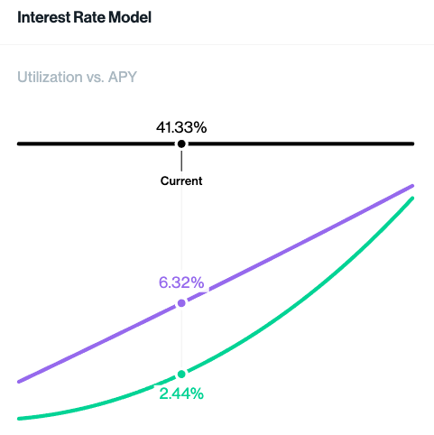
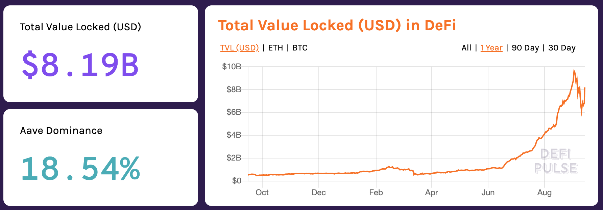

# DeFi从入门到精通之Compound——去中心化的货币市场

2020年在区块链领域最火的莫过于[\#Defi](https://twitter.com/hashtag/DeFi)了, 全称Decentralized Finance，即去中心化金融。“去中心化”对于有些人来说是个政治气味很浓的词，对于技术极客来说却是个美丽新世界。Permissionless Finance或许是个比较中性的别称。简单地讲就是基于智能合约平台之上的金融应用协议\(目前主要是基于Ethereum平台），具有透明公开、可审查、不受单一实体控制的特点。现在很火的几个金融产品领域包括Lending（借贷）、Trading（交易）、Derivative（衍生品）。本期【艺与术】专栏我们就来聊一聊Lending领域的领头羊[Compound Finance](https://compound.finance/), 踮起脚尖我们或许能看到未来金融科技的方向。

Compound其实就是个去中心化的货币市场（Money Market\), 对标传统金融行业的产品就是余额宝了：你有一点闲钱，放在银行卡里给银行送钱，存进余额宝里能每天赚点利息；类似的当你有一点加密货币资产比如BTC和ETH，与其闲置在电子钱包（个人完全控制，不受银行、政府或任何第三方机构控制）里，放进通过Compound协议搭建的货币市场里就能币生币保持资产增值。这些利息是从哪来的呢？货币市场是个双边市场，有资产提供方（Supplier），也有借款方（Borrower），借款方为借得资产付点利息。借款有很多的用途，在传统金融里，我们借钱可以去投资实体经济创业、可以去还之前的贷款、可以加杠杆来放大收益、可以用来做空借入的资产；类似的，Compound的借款方可以用借来的币去加杠杆做多、做空，去投资其他的项目等等。

作为投资者最关心的Compound货币市场的年化收益率（APY）是怎么计算的？如果是去中心化的货币市场，谁来负责调整这个收益率来保证市场的有效性？

这里就要介绍Compound协议的第一个设计：抵押贷款。比如当你想要借入DAI，你不能空手去借，因为在一个去中心化的全球化匿名网络里，你是没有任何信用的（credit），也就很难完成通常的银行**信贷**。但你可以抵押你手上的其他资产，比如ETH或者USDC，这样万一发生违约贷款（default loan），系统就能卖掉抵押资产来平仓。在Compound抵押资产的方式就是在Supply Market提供抵押资产，比如存入USDC（一个1:1瞄定美元的加密货币，属于稳定货币一族），不仅能赚1.56%的年化收益，还能获得一定比例的抵押贷款额度。假设用户存入1000 USDC，按美元计价是$1000, USDC的抵押系数（Collateral Factor）为75%，也就是说抵押1000 USDC，**最多**能贷出来价值$750（贷款额度，Borrowing Capacity）的其他资产，比如750 DAI （DAI也属于瞄定美元的稳定货币一族），或者3 ETH（假设当时ETH价格为$250）。如果抵押资产价格下跌或者借贷资产价格上涨，导致欠的钱超过了贷款额度，就会触发清算。在传统金融里，违约是常有的事，有时候是贷款人忘了还了，有时候是贷款人处于自身利益不打算还了，这时需要借助法律甚至是各种非法方式来讨回贷款。在去中心化金融里，**代码即法律**，由于过度抵押式借贷模型设计（Over-collateralized），部分抵押资产会被清算来偿还超出贷款额度部分的高风险债务，从而再次把债务总额降到贷款额度之下。继续之前的例子，1000 USDC 贷出3 ETH，贷出时价格为$250; 如果ETH价格上升到$300，负债率达到`3 * 300 / 1000 = 90%`。按新的价格清算掉2 ETH对应的USDC数量 `2 * $300 = $600 = 600 USDC`，清算后的负债率为 `1 * $300 / (1000 - 600) = 75%` ，违约风险被消解。这里我对清算过程作了简单化处理方便读者理解，实际智能合约执行中逻辑更复杂。

实现了借贷流程的去中心化后，我们再来探讨下Compound货币市场的利率模型。一个货币市场，如果借贷利率太低，没人愿意把钱借出去，因为回报太低；另一方面，如果借贷利率太高，没人愿意去借钱，因为借贷成本太高，借来的钱能产生的净收益太低。对于一个新的双边网络，如何高效地冷启动来让网络效应这个雪球形成？如何把经济学里经典的供需关系用代码自动化来设计一个自稳定金融系统？

按照经济学理论，假设我们把借贷利率看成关于借贷需求的一个函数。Compound对借贷需求的量化为借出的钱占借贷池里总额的比例 `Demand = Utilization =  Borrows / (Cash + Borrows)`。假设最初借贷池子里有1000 USDC作为启动资金, 对应着 `Cash = 1000, Borrows = 0 => Utilization = 0%`；在之后的另外一个时刻，借出了500 USDC，池子里还剩500 USDC，对应着`Cash = 500, Borrows = 500 => Utilization = 50%`**。**比较符合直觉的一个关系，借贷率越高，也就是需求越高。知道了需求的量化表述后，Compound用了一个 **简单的线性关系**来推导利率 `Borrowing Interest Rate = 2.5% + Utilization * 20%`**。**当借贷率为0时，借贷利息为最低门槛的2.5%，当借贷率为50%时，因为借贷需求很高，此时的借贷利息受此推动上升到12.5%。在一个供需完全自由化的有效市场里，如果借贷利息上升到12.5%，对于持有该资产的投资者来说，是个非常诱人的低风险投资机会，投资者就会把他们的资产存入Compound的借贷池，Cash就因此增加，导致Utilization下载，借贷利率由此回落，形成一个开放市场对价格调节的一个完整周期。

细心的用户会发现实操中Supply Rate（对标余额宝投资年化收益）总是低于Borrow Rate（借贷利息），就会纳闷这中间的利润去哪了？生活中，A向B借了一万元，承诺5%借贷利息，那么A就能拿到5%的借贷收益。在Compound的模型中，投资者是一起拼团把资金放在了一个共同的池子里，想要借钱的人不是单独和某个投资者借钱，而是和那个池子借钱。假设池子里有一万元，有人按5%的借贷利息借了一千元，还款时归还一千元本金和五十元利息，池子里的人需要平摊那五十元利息，算下来收益率就是 `50 / 10000 = 0.5%`**，**也就是借贷利息5%乘以资金利用率（Utilization） 10%。推导一个极端情况，池子里的一万元钱被全部借走，还款时归还一万元本金和五百元利息，此时Supply Rate就等于Borrow Rate，因为资金利用率为100%。

上面讲的都是些模型和理论基础知识，实际应用中Compound协议是如何把现实世界的这套金融规则编码化、自动化、去中心化的呢？这里需要介绍最重要的一个设计: cToken。我们去银行柜台买理财，存入一万元，银行给你一张凭证，凭此凭证和你的身份证件，到期后可以要求兑换本金和收益。cToken对应的就是那张凭证，在基于Web3的去中心化网络里，你的Wallet就是你的身份证件，凭借cToken和Wallet你就能向Compound协议要求赎回本金和收益。以USDC借贷市场为例，假设初始时`1 cUSDC = 1 USDC`**，**随着借贷池里利息收入\(USDC\)的增长，cUSDC对USDC的兑换比例会随着时间越来越高。比如用户最初存入1000 USDC，拿到1000 cUSDC 作为兑换凭证。一年后，`1 cUSDC = 1.2 USDC`**，**用户想要套现，就调用Compound协议的赎回功能，此时的1000 cUSDC代表的USDC为1200 USDC，所以用户最终拿回1000 USDC的本金和200 USDC的利息收入。整个过程全部基于智能合约的公开可验证的逻辑，**不需要任何人员和机构**参与这个过程来帮助验证身份、确认权益、发放收益。至于cToken对它代表的的底层资产兑换比例的设定和更新，Compound智能合约会在每产生一个新以太坊区块时根据那个时间点池子里累计的本金和利息更新每个市场里的cToken的兑换比例。对标传统银行柜台每个工作日早上在小黑板上更新最新的理财收益率，Compound智能合约是在每个以太坊新区块形成时更新最新的Borrow Rate和Supply Rate。通常十几秒会出一个新区块，也就是说每十几秒这些利率会被更新一次。

以上就是关于Compound协议入门级的介绍，希望能帮助更多的读者了解它，甚至打开一扇通向更广大的DeFi世界的窗。

在20年前，DeFi还只是一个小众的区块链应用领域，在一月初只有$660M的TVL（对标传统金融领域的管理资金指标AUM），截止9.13号TVL已经指数级地增长到了$8.19B。这种增长曲线让人有种17年ICO泡沫的Déjà vu。尽管鱼龙混杂，深入的观察者和长期的投资者能看到一股新新的力量正在酝酿，当钱可编程化、关于钱的合约可交互化、世界上任意角落的钱都能参与到一个全新的金融市场里，我们已然能看到一种新的金融范式革命。

\*\*\*\*

**参考文献**

1. \*\*\*\*[**https://compound.finance/documents/Compound.Whitepaper.pdf**](https://compound.finance/documents/Compound.Whitepaper.pdf)\*\*\*\*
2. \*\*\*\*[**https://ethereumprice.org/guides/article/compound-finance-explained/**](https://ethereumprice.org/guides/article/compound-finance-explained/)\*\*\*\*
3. \*\*\*\*[**https://zhuanlan.zhihu.com/p/114319666**](https://zhuanlan.zhihu.com/p/114319666)\*\*\*\*

